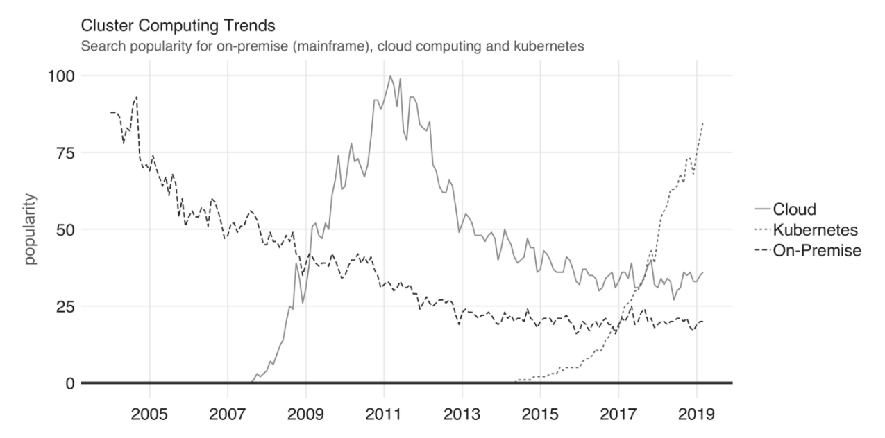
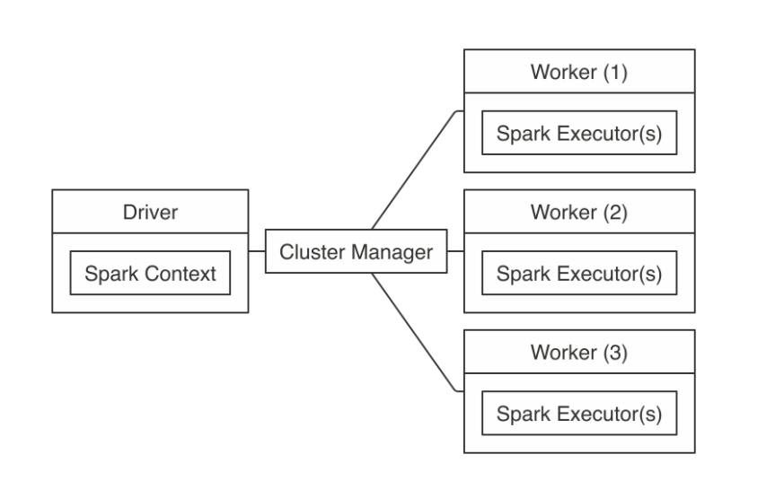
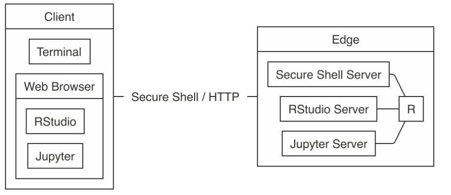
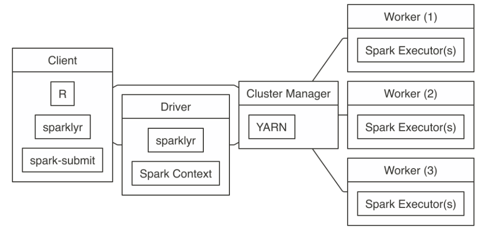

```{r setup, include=FALSE}
knitr::opts_chunk$set(echo = FALSE)
```

## Cluster Computing
A computing cluster is a collection of computers which can be used for high performance computing or storing large data sets. There are three options for how to approach computing clusters.

- On-Premises: Purchase racks of stacked computers. This has a high upfront cost, requires lots of space, and can be expensive to maintain. However, it offers completely customization. 

- Cloud: Rent computing power from a company that already has on-premises computing clusters. You only pay for what you need, but you have less control of what is available. An example of this service is AWS, which began in 2003.

- Kubernetes: Works as an interface for container orchestration across multiple could computing services. It is the most recent way to host a data center, only being introduced in 2014.

## Popularity Shifts
We can see the on premises clusters are becoming less popular, while cloud clusters and Kubernetes are becoming more popular. 



## Cluster Managers
When interacting with a data center you need to have a cluster manager. Think of a cluster manager like an operating system for your computing cluster, which allows for multiple applications to be run simultaneously. 

Spark Standalone is Spark's own cluster manager. Useful if you know that you will only be running Spark applications.

## Spark Connection Architecture



## Master and Worker Nodes

This is an example of setting up a master node and a worker node in Spark.

```{r, eval=FALSE, echo=TRUE}
# Retrieve the Spark installation directory
spark_home <- spark_home_dir()

# Build paths and classes
spark_path <- file.path(spark_home, "bin", "spark-class")

# Start cluster manager master node
system2(spark_path, "org.apache.spark.deploy.master.Master", wait = FALSE)

# Start worker node, find master URL at http://localhost:8080/
system2(spark_path, c("org.apache.spark.deploy.worker.Worker",
                      "spark://address:port"), wait = FALSE)
```

## Alternative Cluster Managers
Many data centers might want to run non Spark applications. In these cases one can use more general cluster managers.

- Hadoop YARN: Resource manager for the Hadoop project. It is likely to already be installed on many clusters. 
- Mesos: Mesos also supports executing many cluster frameworks; however, Mesos allows the use of custom task schedulers. 
- Kubernetes: A way to interact with conainerize versions of computing clusters.

## Connecting to a Spark Cluster
When connecting with a Spark data center we typically use either a web browser or terminal. 

- terminal: Connect via **ssh** and use $\texttt{sparklyr}$ in an *R* environment in the terminal. 
- web browser: Connect via **http**/**https** and use Rstudio server or Jupyter to connect to the server. 






